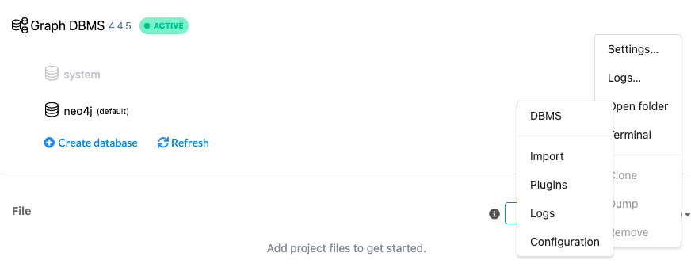
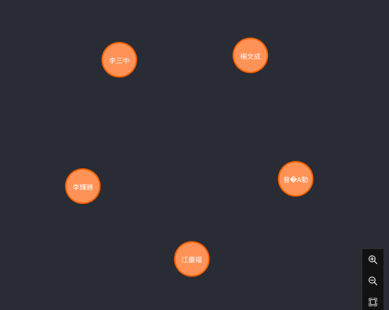
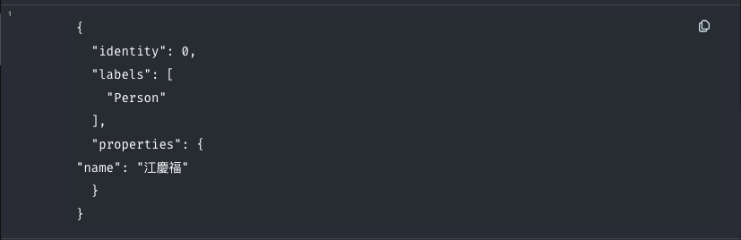
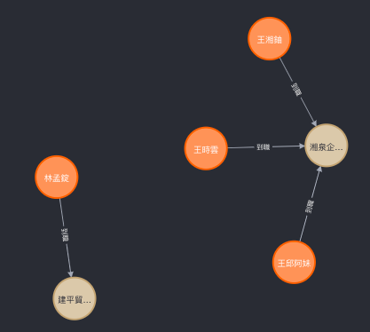

官網的 csv教學：https://neo4j.com/docs/cypher-manual/current/clauses/load-csv/

### 填裝csv

將 csv 放入 Import 資料夾中

```cypher
LOAD CSV WITH HEADERS FROM "file:///company_short.csv" AS csvLine
MERGE (person:Person {name: csvLine.經理人姓名});
```
```cypher
MERGE (p: Person)
RETURN p
LIMIT 5
```



table like

### 製作關係
(人) -> [到職] -> (公司)
```cypher
LOAD CSV WITH HEADERS FROM "file:///company_short.csv" AS csvLine
MERGE (person:Person {name: csvLine.經理人姓名})
MERGE (company:Company {name: csvLine.公司名稱})
CREATE (person)-[:到職 {到職日期: csvLine.到職日期}]->(company)
```
也等價於
```cypher
:auto LOAD CSV WITH HEADERS FROM "file:///company_short.csv" AS csvLine
CALL {
WITH csvLine
MERGE (person:Person {name: csvLine.經理人姓名})
MERGE (company:Company {name: csvLine.公司名稱})
CREATE (person)-[:到職 {到職日期: csvLine.到職日期}]->(company)
} IN TRANSACTIONS
```

#### [[待辦清單#^db4e61|關於 CALL 和 TRANSACTIONS]]
因為 cypher本身很慢，所以當csv很大時，需要大量的時間與記憶體，所以就延伸出了讀多少做多少事，來釋放對記憶體的需求
過去是使用 
```cypher
USING PERIODIC COMMIT 500
LOAD CSV WITH HEADERS FROM 'file.csv' AS ROW
```
一次只做500列，等方式來讀取大csv，但這個方法在新版被移除掉了（我也不知道原因）取代的是（本來舊有的方法）
```cypher
:auto
CALL
IN TRANSCATIONS
```
讀多少做多少，變成即時製作
詳細閱讀：https://neo4j.com/docs/cypher-manual/current/introduction/transactions/
我也正在閱讀